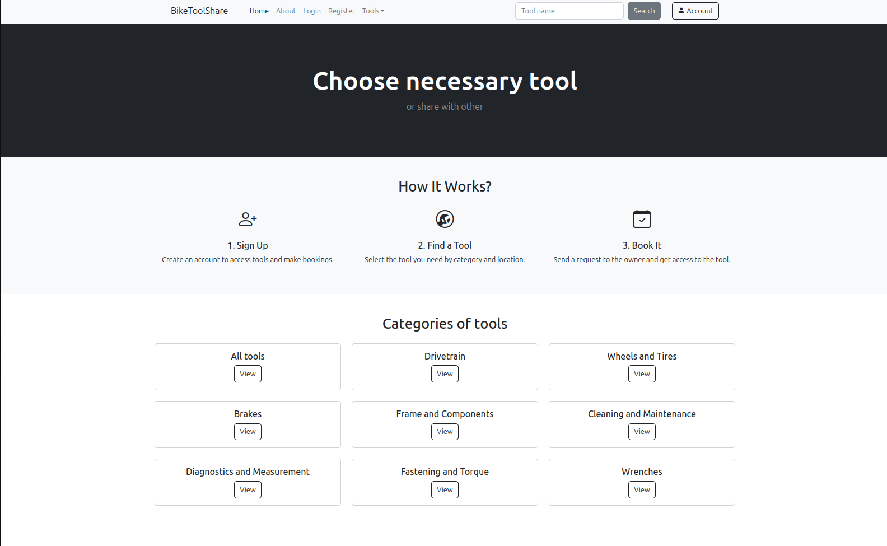
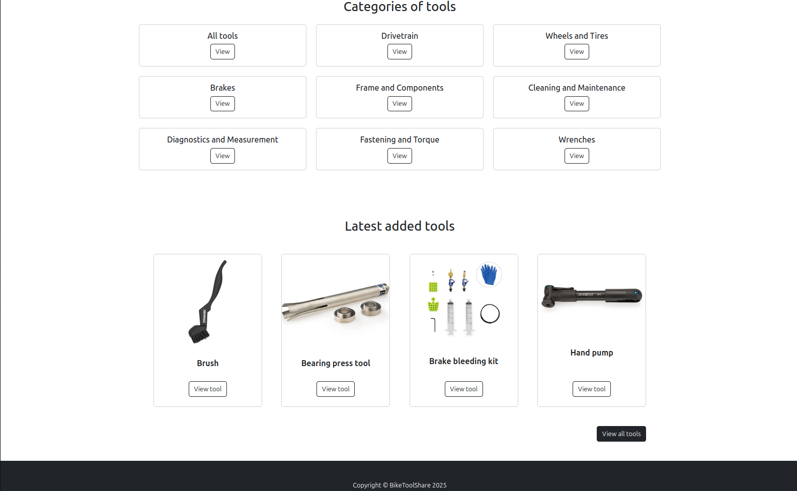
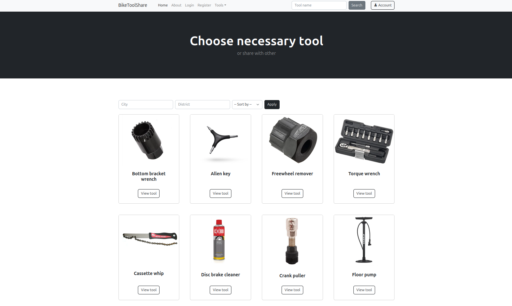
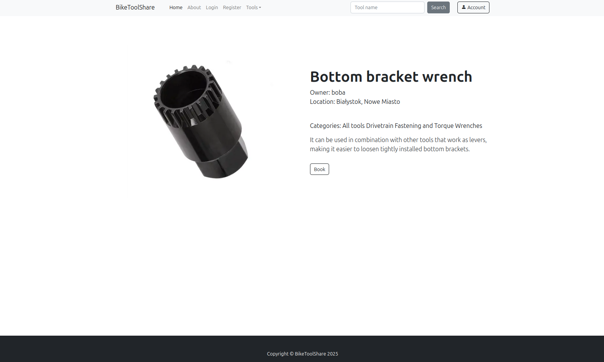
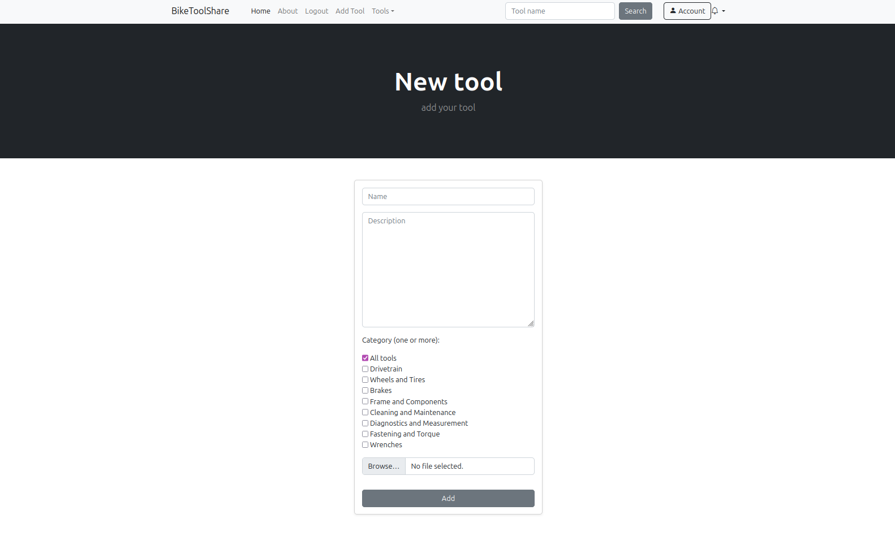
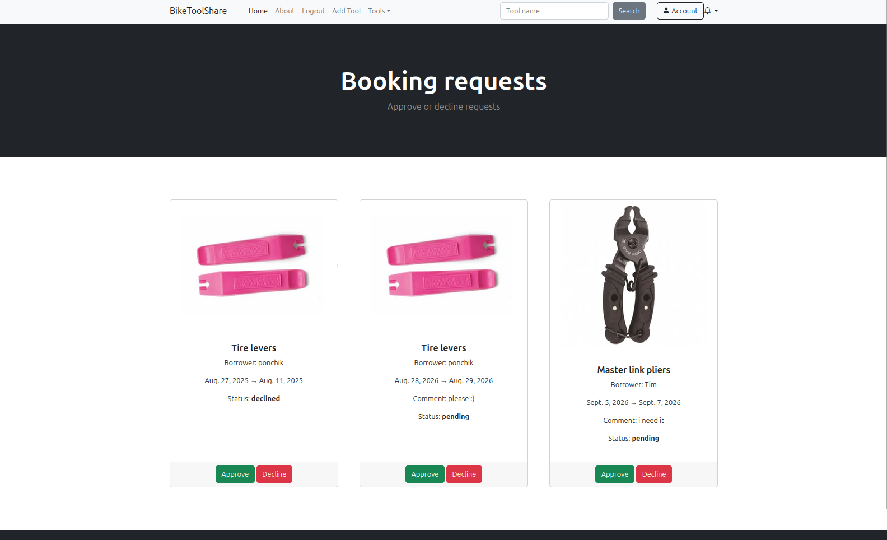
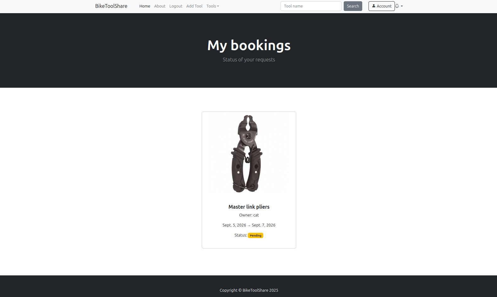
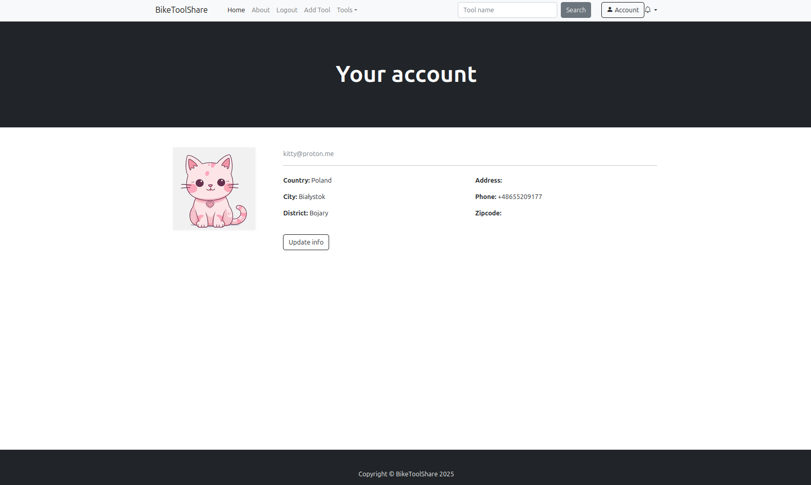

# 🚲 BikeToolShare

> A web application for borrowing and lending bicycle repair tools.


## 📖 Overview

BikeToolShare is a Django-based web application that allows cyclists to lend and borrow bicycle repair tools within their local community.

The platform enables users to create an account, add their own tools, browse available equipment, search by name, filter tools by location, and send booking requests to tool owners. Owners can approve or decline requests, while both sides can track the status of their bookings.

The project was developed as a personal portfolio application and focuses on backend development, database design, user authentication, and implementing a complete booking workflow.

## 💡 Motivation

The idea for BikeToolShare came from my own experience.

Cycling has been an important part of my life for many years. I ride different types of bicycles, including mountain, road, fixed-gear, and gravel bikes. Each of them requires different maintenance procedures and often specialized tools that are expensive and rarely used.

After moving to a new city, I struggled to find bicycle workshops capable of repairing older or less common bikes. As someone with an engineering background, I started maintaining my bicycles myself, but quickly realized that buying every specialized tool simply wasn't practical.

BikeToolShare was created to solve this problem.

Instead of purchasing tools that may only be needed once, users can borrow or lend bicycle repair tools through the platform. Besides reducing repair costs, the platform encourages people to learn bicycle maintenance, helps build local cycling communities, and promotes sharing instead of unnecessary consumption.
## ✨ Features

| Feature             | Description |
|---------------------|-------------|
| User authentication | User registration, login and logout |
| User profiles       | Personal profile with location and contact information |
| Tool management     | Add, edit and delete tools |
| Image upload        | Upload images for tools and user profiles |
| Categories          | Organize tools into multiple categories |
| Search              | Search tools by name |
| Filters             | Filter tools by city and district |
| Sorting             | Sort tools by creation date |
| Booking system      | Send booking requests to tool owners |
| Booking management  | Approve or decline booking requests |
| Booking requests    | View sent and received booking requests |
| Latest tools        | Display recently added tools on the homepage |

## 📸 Screenshots

### Home page
The application's landing page displaying the main banner and navigation.


The homepage also highlights the most recently added tools.


### Browse tools
Search, filtering by city and district, and sorting available tools.


### Tool details
Detailed information about a selected tool with the option to submit a booking request.


### Add a new tool
Authenticated users can add new tools with descriptions, categories and images.


### Booking requests
Tool owners can approve or decline incoming booking requests.


Users can track the status of their own requests.


### User profile
Personal profile with location, contact information and profile picture.


## 🛠 Tech Stack

| Category | Technologies |
|----------|--------------|
| **Backend** | Python, Django |
| **Database** | PostgreSQL, Django ORM |
| **Frontend** | HTML, CSS, Bootstrap |
| **Authentication** | Django Authentication System |
| **Media Handling** | Pillow |
| **Testing** | pytest |
| **Version Control** | Git, GitHub |

## 📁 Project Structure

```text
BikeToolShare/
├── accounts/          # User accounts, authentication and profiles
├── booking/           # Booking workflow and request management
├── tool/              # Tool management and search functionality
├── templates/         # HTML templates
├── static/            # Static files (CSS, images)
├── media/             # Uploaded images
├── BikeToolShare/     # Project configuration
└── manage.py
```

## 🗄 Database Design

The application is built around four core entities:

- **User** – manages authentication, user profiles, tool ownership, and borrowing requests.
- **Tool** – stores information about bicycle repair tools, including descriptions, images, availability, and ownership.
- **Booking** – represents the borrowing workflow, including booking dates, request status, and communication between tool owners and borrowers.
- **Category** – organizes tools into categories, allowing flexible classification and easier searching.

### Entity Relationships

| Relationship | Type |
|--------------|------|
| User → Tool | One-to-Many |
| Tool → Booking | One-to-Many |
| User → Booking | One-to-Many |
| Tool ↔ Category | Many-to-Many |

The booking system is implemented as a separate entity rather than a simple relationship between users and tools. This design makes it easier to extend the application with additional features such as notifications, booking history, ratings, or other future functionality.

## ✔️ Testing

The project includes automated tests written with **pytest**.

Current test suite includes:

- **Accounts** (10 tests)
  - user registration
  - authentication and logout
  - profile update
  - context rendering

- **Tools** (20 tests)
  - search functionality
  - filtering by city, district and category
  - sorting
  - CRUD operations
  - authorization and ownership permissions

- **Bookings** (7 tests)
  - creating booking requests
  - preventing users from booking their own tools
  - approving and declining requests
  - displaying bookings for owners and borrowers

## 🚧 Challenges

The most challenging part of the project was designing a flexible database structure that could be extended with additional functionality in the future.

Other challenges included:

- designing relationships between users, tools and bookings
- implementing the booking workflow and request lifecycle
- separating permissions between tool owners and borrowers
- managing notifications using context processors
- supporting image uploads for tools and user profiles

## 🚀 Future Improvements

Planned features include:

- interactive map displaying available tools nearby
- email and Telegram notifications about booking updates
- internal messaging between users
- user ratings and reputation system
- image moderation for uploaded content
- extended booking history and statistics

## ⚙ Installation
Requirements
```
Python 3.12+
PostgreSQL
```

Clone the repository

```bash
git clone ...
```

Move into the project directory

```bash
cd BikeToolShare
```

Create and activate a virtual environment

```bash
python -m venv venv
```

Install dependencies

```bash
pip install -r requirements.txt
```
Create a `.env` file in the project root and configure the following environment variables:

```env
SECRET_KEY=your_secret_key

DB_NAME=your_database_name
DB_USER=your_database_user
DB_PASSWORD=your_database_password
DB_HOST=localhost
DB_PORT=5432
```

Apply migrations

```bash
python manage.py migrate
```

Create a superuser (optional)

```bash
python manage.py createsuperuser
```

Run the development server

```bash
python manage.py runserver
```

## ✅ Running Tests

Run all tests using:

```bash
pytest
```